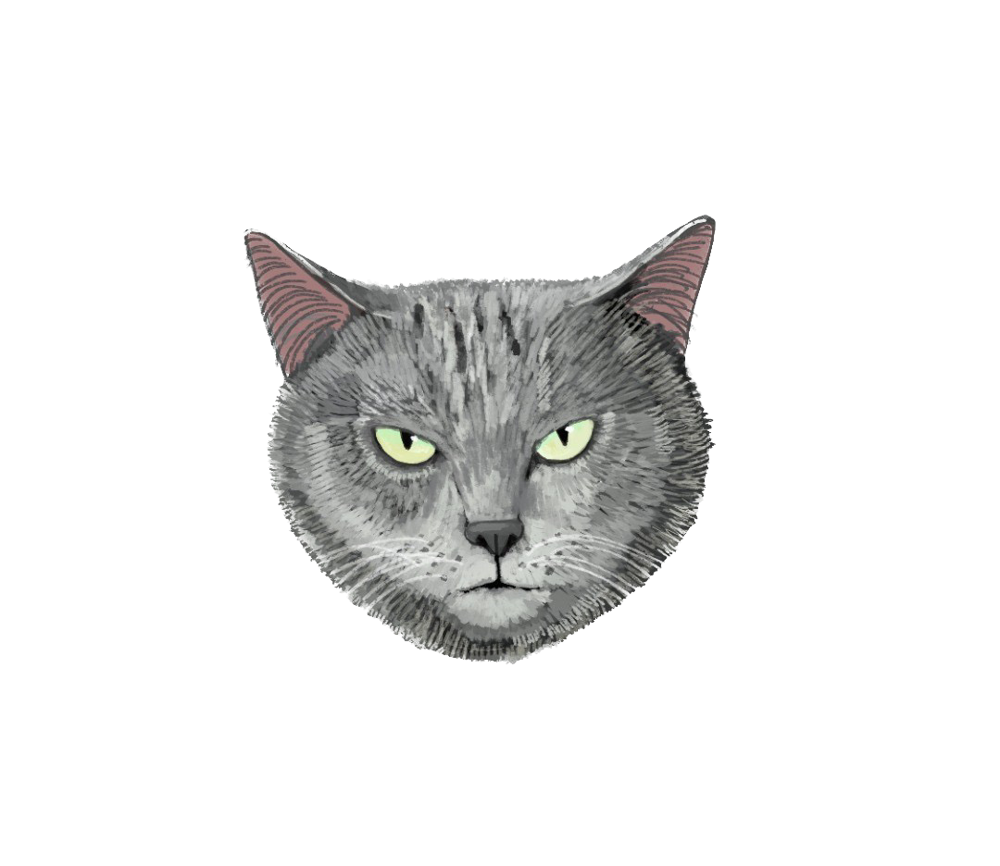

 

- 🦢 Hi, I’m Gemma, on GitHub my username is @smolTypo
- 🪸 I’m currently battling impostor syndrom / developing my coding skills with MIT xPRO Full Stack bootcamp
- 🫧 Not now, but someday, in some way, we will collaborate on something great!
- 🛼 How to reach me: serendikitty@gmail.com

<!---
smolTypo/smolTypo is a ✨ special ✨ repository because its `README.md` (this file) appears on your GitHub profile.
You can click the Preview link to take a look at your changes.
--->
